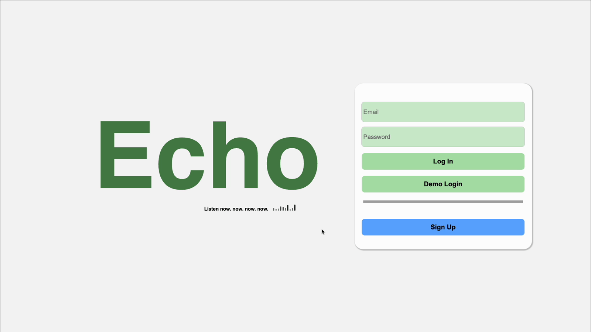
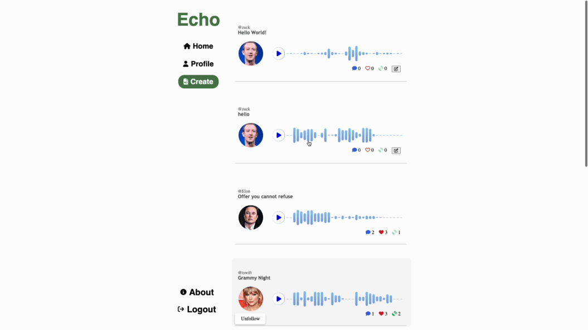

# ECHO


## Introduction
Echo is a social media platform built around the creation and sharing of short voice notes, or as we call them: Echos. Echos are short audio recordings users can share to their profiles and feed. The recordings are limited to 30 seconds in length, and followers will be able to listen, like, comment, and reverb (retweet) the Echo.

Echo was built using the MERN stack by a team of three engineers in just over a week.





## Functionality and MVP
### Core Features
- User Authentication
- CRUD functionality for Echos
- Follow / Unfollow
- Replies / Likes
- Reverbs (Retweet in Echo-speak)

### Bonus Features
- In browswer audio recording for Echos and replies

## Technologies
* Express Backend
* React Frontend
* MongoDb/AWS for our noSql database and audio storage respectivley
* Wavesurver.js Javascript library for our audio player functionality.

### Code Snippets

One of the first things we set out to do was find a library to help build out the audio "waveform" of our Echos. We landed on Wavesurfer.js to generate an audio player:

```js
  useEffect(() => {
        const mySong = WaveSurfer.create({
            container: `#${waveformId}`,
            waveColor: ['#88cafb', "#7a49a5"],
            barRadius: 100,
            height: 50,
            barWidth: 7.5,
            cursorColor: "#7a49a5",
            cursorWidth: 0,
            dragToSeek: true,
            hideScrollbar: true,
            normalize: true,
            url: audioUrl
        });

        mySongRef.current = mySong;

        mySong.on('finish', () => {
            setSongPlaying(false);
            mySong.seekTo(0);
        });

        return () => {
            mySong.destroy();
        };
    }, [audioUrl, waveformId]);
```

Now that we have the waveform we are looking for. We wanted to create a User-friendly way for recording your Echos within the browser.

```js
const EchoRecorder = ({ setAudio, setAudioUrl }) => {
    const {
        startRecording,
        stopRecording,
        recordingBlob,
        isRecording,
        recordingTime,
    } = useAudioRecorder();
    
    const addAudioElement = useCallback((blob) => {
        const url = URL.createObjectURL(blob);
        const audio = new Audio()
        audio.src = url;
        setAudio(blob)
        setAudioUrl(audio.src)
    }, [setAudio, setAudioUrl]);

    useEffect(() => {
        if (!recordingBlob) return;
        addAudioElement(recordingBlob)
    }, [addAudioElement, recordingBlob])

    useEffect(() => {
        if (recordingTime >= 30) {
            stopRecording()
        }
    }, [recordingTime, stopRecording])

    const handleClick = () => {
        if (isRecording) {
            stopRecording()
        } else {
            startRecording()
        }
    }

    return (
        <>
            <div className={`${isRecording ? 'audio-recorder-is-recording' : 'audio-recorder-not-recording' }` } onClick={handleClick}>
                {!isRecording && <i className={`fa-solid fa-microphone audio-recorder-mic`}></i>}
                {isRecording && <p className={`audio-recorder-count`}>{recordingTime < 10 ? `0${recordingTime}` : `${recordingTime}`}</p>}
                {isRecording && <RecordingAnimation />}
            </div>
        </>
    )
}
```





